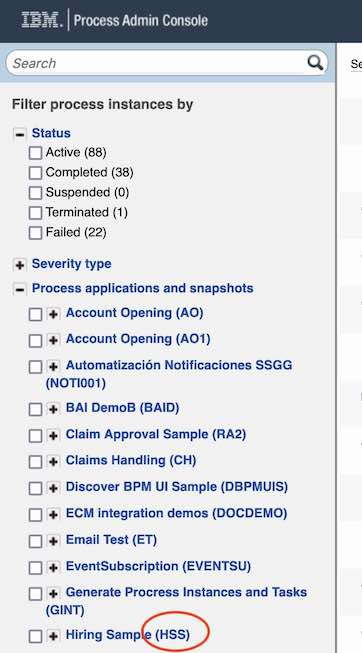
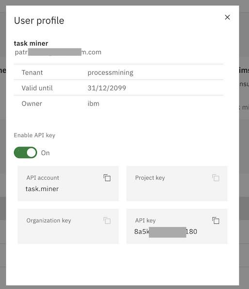

# Accelerator for IBM Business Automation Workflow and IBM Process Mining
## NOTE
To obtain the librairies required to execute the accelerator, please contact Patrick Megard (patrick.megard@fr.ibm.com).

## Introduction
This repository is a free contribution provided as-is to easily connect IBM Business Automation Workflow and IBM Process Mining.

When using IBM Process Mining to analyse BAW processes, process owners and analysts get a full objective picture of these processes: activities and transition frequencies, durations, costs, reworks, variants, and deviations. 

Process Mining helps understanding the business reasons that lead to non-optimal processes. Contextual data available in the process events are used to understand the root-causes, to mine the workflow business rules, and to create and monitor business KPIs in intuitive dashboards.

After having discovered the problems and having analyzed the root-causes, the analysts can plan for workflow improvements: automating a manual activity with a RPA bot, automating a business decision with business rules, changing the workflow, and so forth. 

With Process Mining, analysts can create what-if simulation scenarios in order to obtain instantly the ROI, the to-be KPIs.

## How to Use the Accelerator
This is a no-code accelerator that can be used by process owners and analysts who just need to fill-out a form to:
- Connect to the BAW server
- Select the BAW process to mine
- Optionnaly connect to the IPM server to automatically load the event log into a process mining project
- Optionnaly set an udate rate (in seconds) to extract new data regularly
- Optionnaly set an extraction period in days to fraction the extraction workload
- Optionnaly exclude some BAW data
- Run several extraction jobs that can be stopped and resumed.

## How to Install the Accelerator
Prerequisite: Python3 

Get this repository in your local environment

Go to the project directory, create a python virtual environment, activate the environment and install the packages.

```
python3 -m venv myenv
source myenv/bin/activate
pip install -r requirements.txt
pip install django
pip install requests
python manage.py migrate
```

The Web server is using Django. You need to generate a Django secret and to add it line 25 of ```execute_script/settings.py```.
You can generate a Django key from this site: https://djecrety.ir/


Contact Patrick Megard to get access to the libraries contained in this github repo:
https://github.com/Patrick-Megard/ibm-process-mining-connectors-utilsWhen you get access, download the zip file, and uncompress it.

You will obtain a folder called ```ibm-process-mining-connectors-utils-main```
Copy all the files that are in this folder into the ibm-process-mining-BAW-accelerator


## How to Run the Accelerator
When running a new shell you need to activate the virtual environment before executing the accelerator script:
```
source myenv/bin/activate
```

Run the accelerator:
```
python3 manage.py runserver
```

When the server is started, open a web browser and connect to your local host URL: `http://127.0.0.1:8000/`

Alternatively, when a configuration json file is saved, you can directly run the extraction by executing the python program
```
python3 BAW_to_IMP.py config/config_myJobName.json
```

## Configuring the extraction job
Each configuration requires a job name. The job name is used to identify the json configuration files and the CSV files.
For instance, if the job name is `myJobName`, the configuration file is saved in `config/config_myJobName.json`.<br>
The BAW event logs are saved in `data/BAW_myJobName_<timestamp>.zip` 

The Web UI enables:
- Creating a new extraction configuration 
- Editing an existing configuration
- Copying a new extraction configuration from an existing one (time saving)
- Deleting a configuration. Note that the json file is not deleted, the entry in the application DB is deleted.

## BAW connection and password
The BAW connection requires a root URL, a user ID, and a password.


## Running an extraction job
Before running an extraction job, you can set some running parameters
- Extraction loop rate defines the pause time between each extraction. The JSON file enables entering any value as seconds. When the job includes a loop rate, the last extraction period is saved such that restarting the job does not extract the same data again.
- Extraction interval is expressed as days. This value specifies a time window for which we want to extract BAW data. For example if the extraction interval is 1 day, at each loop we will extract 1 day of data, and the time window is shifted for the next loop. An extraction loop rate and a modified_after date are required to use this feature. Extraction interval can be used to lower the load on the BAW server and the RAM needed.
- Number of threads increases the speed by splitting the extraction work into several threads. This increase the load on the BAW server too. A good balance needs to be found.
- Instance limit is used for testing only: each extraction stops when the number of instance specified here is reached. This is useful when sizing the time required to get historical data, or the load on the BAW server or on the RAM
- Create a CSV at each loop generates a CSV file at each extraction loop (if events were retrieved). When unchecked, the CSV file is generated when the job is completed, stopped, or when the number of events reaches 500k events (the value can be changed in a code variable)

- A job can be stopped if it is looping. The stop is taken into consideration while the job is sleeping.
- Several jobs can be executed simultaneously.

Running a job without the WebUI is straightforward, and this way it can be scheduled using crontabs
```
python3 BAW_to_IMP.py config/config_myJobName.json
```

## Configuring the accelerator for BAW
The accelerator settings are managed in a form opened at `http://127.0.0.1:8000/`

You can use the accelerator to fetch the data from BAW and store the resulting CSV file in your local directory. You will then be able to load manually the CSV file into IBM Process Mining. In this case, you only need to have:
- IBM BAW admin login and password
- The process name (application) that you want to mine
- The project name to which the process belongs (acronym)

- You can enter the password in the Web UI or in the configuration file. But the password is visible in the configuration file
- You can store the password in an environment variable of your choice, and provide the environment variable name to the Web UI. This way, the password is not visible in the configuration file. <br>
Example from a linux shell:
```
export BAW_PASSWORD=myBAWPassword
```

The other BAW parameters are optional:

- Modified after: Retrieve process instances modified after the date expressed like this: 2022-06-01T22:07:33Z
- Modified before: Retrieve process instances modified before the date expressed like this: 2022-06-01T22:07:33Z

If you want to add specific process or task variables, you can list them in the "Business data" field of the job config file. Read the BAW data section below for more details

If the IBM Process Mining configuration left empty, the resulting CSV files will be loaded manually in IBM Process Mining.

In BAW, you can find the project name (acronym) in parenthesis besides the process name in <BAW_URL>/ProcessAdmin. 

See a screen shot of the BAW inspector at the bottom of this document

## Extracting the BAW business data
- Include exposed variables: If the process has declared exposed variables, these data can be automatically added to each event. The field name of each tracked data in the resulting CSV file starts with 'trkd'. Ex: trkd.requisition.requester. 

You can add any process or task data into the CSV. In the Web UI, list each data path separated with a comma (,). For example:

`requisition.requester,requisition.gmApproval,currentPosition.jobTitle,currentPosition.replacement.lastName`.

The field name for each variable in the resulting CSV file starts with 'tsk'. Ex: tsk.requisition.gmApproval

WARNING: a process mining project can only load CSV file with the same columns. If you add or remove a field during an extraction, you can't load it in an existing process mining project that loaded CSV files with different columns.

You can find these data in BAW process designer.

## Extracting the BAW process data
The configuration file `BAW_default_fields.json` can be modified to change the mapping between the BAW data and the default process mining fields, or to exclude more or less task common data. Copy the default file before modifying it.

You could change the mapping in :
```
  "process_mining_mapping": {
        "process_ID":"piid",
        "task_name":"name",
        "start_date":"startTime",
        "end_date":"completionTime",
        "owner":"owner",
        "team":"teamDisplayName"
    },
```

You could add task data that you don't need in this list, or keeping some by removing them from the list.
```
  "excluded_task_data": [
        "description",
        "clientTypes",
        "containmentContextID",
        "kind",
        "externalActivitySnapshotID",
        "serviceID",
        "serviceSnapshotID",
        "serviceType",
        "flowObjectID",
        "nextTaskId",
        "actions",
        "teamName",
        "teamID",
        "managerTeamName",
        "managerTeamID",
        "displayName",
        "processInstanceName",
        "assignedTo",
        "assignedToID",
        "collaboration",
        "activationTime",
        "lastModificationTime",
        "assignedToDisplayName",
        "closeByUserFullName"
    ]
```

The list of the default data is for reference only, it is not used by the program, but you can select from here data that you want to exclude.
```
    "included_task_data": [
        "activationTime",
        "atRiskTime",
        "completionTime",
        "description",
        "isAtRisk",
        "originator",
        "priority",
        "startTime",
        "state",
        "piid",
        "priorityName",
        "teamDisplayName",
        "managerTeamDisplayName",
        "tkiid",
        "name",
        "status",
        "owner",
        "assignedToDisplayName",
        "assignedToType",
        "dueTime",
        "closeByUser"
    ],
```

## Configuring the accelerator for IBM Process Mining

You can use the accelerator to fetch the data from BAW, and to automatically load the resulting CSV file into IBM Process Mining. The following parameters are required:
- IBM Process Mining
- User ID
- API Key
- Organization ID
- Project key

If the project key exists in the organization, the data is loaded into this project.<br>
If the project key does not exist yet, a new project is created with the same name.
Note= project keys can't include blank spaces. Use names like 'hiring-process'

In the IBM Process Mining User Profile, make sure you have API key enabled, and copy the API account and the API key.

See a screen shot of the Process Mining screen at the bottom of this document


## Configuration file
Instead of using the web server to configure an extraction job, you can create an edit configuration files. The configuration below results from the parameters entered with the Web UI.
Note how the BAW business data are implemented in JSON.

```
{
    "JOB": {
        "job_name": "CREATED",
        "update_rate": 0,
        "exit": 0
    },
    "BAW": {
        "root_url": "http://baw.com/",
        "user": "admin",
        "password": "",
        "password_env_var": "BAW_ADMIN_PASSWORD",
        "project": "prj",
        "process_name": "process",
        "modified_after": "",
        "modified_before": "",
        "extraction_interval": 0,
        "thread_count": 1,
        "instance_limit": -1,
        "task_data_variables": [],
        "export_exposed_variables": false,
        "csv_at_each_loop": false,
        "last_after": "",
        "last_before": ""
    },
    "IPM": {
        "url": "",
        "user_id": "",
        "api_key": "",
        "org_key": "",
        "project_key": "",
        "version": "1.13.1+"
    }
}
```

## Screen shot to find connection parameters






